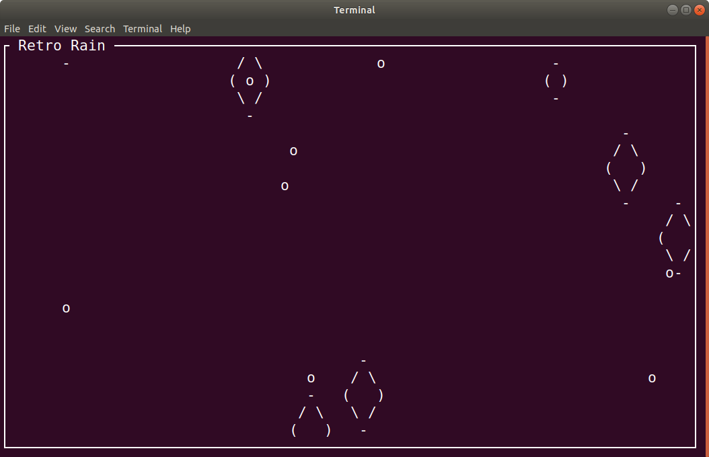

# Retro Rain - A Curses Warm Up

This program is a gentle introduction to curses.

**Due to the gentle nature of this project, all work must be done solo.**



# Exactly *three* files must be submitted

I provide ```main.cpp``` and ```drop.hpp```.

You must write ```drop.cpp``` exactly according to these specifications. Any deviation will be penalized.

# ```main.cpp```

It is preferred that you download this file rather than copy / paste from here. At times bogus web characters can find there way into code files causing hard to find bugs.

```c++
#include <iostream>
#include <ctime>
#include <curses.h>
#include <thread>
#include <chrono>

#include "drop.hpp"

using namespace std;

int main(int argc, char * argv[]) {
	Storm storm;

	srand((unsigned int) time(nullptr));
	initscr();
	curs_set(0);
	while (true) {
		erase();
		storm.Birth();
		storm.Draw();
		storm.Cull();
		box(stdscr, 0, 0);
		mvaddstr(0, 1, " Retro Rain ");
		refresh();
		this_thread::sleep_for(chrono::milliseconds(100));
	}
	endwin();
	return 0;
}
```

Notice how clean ```main()``` is. 

# ```drop.hpp```

```c++
#pragma once
#include <deque>

struct Drop {
	Drop();
	void Draw();
	bool TimeToDie();

	struct {
		int l, c;
	} center;
	int age;

	static const int MAXIMUM_AGE = 3;
};

struct Storm {
	void Birth();
	void Cull();
	void Draw();
	std::deque<Drop> drops;
};
```

There are two structs declared here. You must not deviate from these declarations.

You are to implement all features of these two structs according to this specification.

# Implementation

## ```Drop::Drop()```

As you know, once curses has been initialized via ```initscr()``` the ints ```LINES``` and ```COLS``` are valid. ```Drop::Drop()``` initializes the ```l``` and ```c``` members of the *anonymous struct* named ```center```. It also sets ```age``` to zero.

## ```Drop::Draw()```

There are three renderings for drops. They are rendered in sequence over three refreshes of the screen offset from ```l``` and ```c```. These are...

Age 0:
```
o
```

Age 1:
```
 -
( )
 -
```

Age 2:
```
  -  
 / \
(   )
 \ /
  -
```

Each time ```Draw()``` is called, the drop's age increases.


## ```Drop::TimeToDie()```

Returns ```true``` if ```age``` is or exceeds ```MAXIMUM_AGE```. [Some of the most beautiful words in cinema](https://en.wikipedia.org/wiki/Tears_in_rain_monologue)

## ```Storm::Birth()```

On every frame, 1 to 12 drops will be created and pushed onto the back of ```drops```.

## ```Storm::Draw()```

The entire ```deque``` of drops are asked to draw themselves.

## ```Storm::Cull()```

Notice that the youngest drops are at the back of the ```deque```. The oldest drops are at the front. ```Cull()``` contains a loop that will ask front drop if it is time for it to die. If it is, it is popped from the front of the ```deque```. The loop stops if the ```deque``` is empty or the front-most drop has not yet reached the age of death.

# Sleeping (for delay)

These includes are needed to provide a portable means of delaying execution for periods of time. Prior to C++ 11 each operating system had its own means of delay causing source code to jump through hoops to run on more than one.

```c++
#include <thread>
#include <chrono>
```

This line pauses the execution of your program for at least 100 milliseconds.

```c++
this_thread::sleep_for(chrono::milliseconds(100));
```

# ```main()``` has an infinite loop

Exit this program by depressing ```c``` and the ```control``` key at the same time.

If your terminal should stop echoing your typing after killing the program try:

```stty sane```

at the shell prompt (and hit return). This should fix it.

# ```deque```

Can be found [here](http://www.cplusplus.com/reference/deque/deque/). Standing for *double ended queue* a ```deque``` is like a ```vector``` but is better at deleting the front than a ```vector```.


