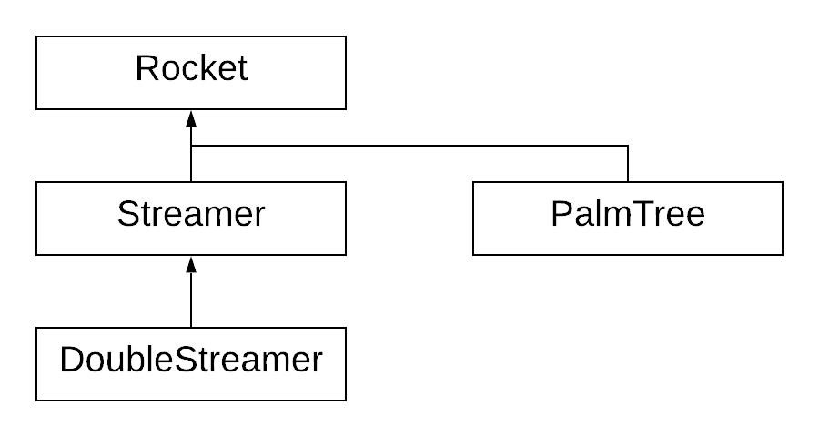

# Rocket class

Then, you will create subclasses of ```Rocket``` which draw more interesting fireworks. The *is a* relationship is readily apparent. A ```Streamer``` is a ```Rocket``` that exploded with a circular pattern.

Here is the Rocket class (you must use it verbatim):

```c++
#pragma once
#include <limits>
#include <vector>
#include <fstream>

/*	frand() is defined in main.cpp.
*/

float frand();

class Rocket
{
  public:
	Rocket();
	virtual ~Rocket();

	void SetTriggerAge(int i);
	void SetAgeLimit(int i);
	void SetPosition(Rocket &other);
	void SetPosition(float x, float y);
	void SetForce(float x, float y);
	virtual void Draw();
	virtual void Step(std::vector<Rocket *> & v);
	virtual void Trigger(std::vector<Rocket *> & v);

	int GetAge();
	bool IsAlive();
	bool IsTriggered();

	static void SetGravity(float g);

  protected:
	int age;
	int age_limit;
	int trigger_age;

	struct
	{
		float x, y;
	} position;

	struct
	{
		float x, y;
	} force;

	static float gravity;
};

```

## Anonymous structs

In the above, ```position``` and ```force``` are ways of making convenient
bundles of related variables. There are other ways, of course, including
making a class that provides functions for managing math on x,y pairs.

For example:

```c++
Rocket r;
r.force.x = 0.0;
r.position.y = 22.0;
```

## Static members

### Static data

```gravity``` is shared by all instances of ```Rocket```. As such, it is 
appropriate to mark it as ```static```. This means that for all instances of ```Rocket``` there are only one ```gravity```. All instances of ```Rocket``` shares the same float.

A static data member is declared in the class but space has to be reserved for them in your code. In a code file called, for example, ```rocket.cpp``` the following lines must appear in the global scope.

```c++
float Rocket::gravity = -0.2;
```

### Static method

Notice there is static *setter* method called ```SetGravity``` for giving a custom value to ```gravity```. This method is also marked ```static``` though technically, there is no requirement for this in this case.


## Constructor

Set the ```age_limit``` and ```trigger_age``` to an effectively infinite value. This is why ```limits``` is included. The snippet below shows how to get the largest integer.

```c++
numeric_limits<int>::max()
```

Set all the other values to 0.

## Destructor

The destructor doesn't need to do anything. It is here to provide a very gentle introduction to them. We discussed the role of the destructor as a bookend to the constructor.

## bool IsAlive()

You may need an easy way to determine if a particle has aged out, for example during culling.

## bool IsTriggered()

This method should return true if the particle's age is at or above the trigger age.

## void Trigger(vector<Rocket *> & v)

```Trigger``` should be called when the particle reaches its trigger age. The method takes a reference to a vector of Rocket pointers. Any sub rockets that the ```Trigger``` creates should be pushed onto this vector.

## SetGravity(float g)

Set the ```gravity``` data member.

## SetAgeLimit(int a)

Set the age when a particle should be culled.

## SetTriggerAge(int a)

Set the age when a particle should be triggered. 

## Step(vector<Rocket *> & v)

Advance the physics simulation for this particle.That involves applying gravity to the particle's remaining force and updating the particle's position.

The age of the particle is also advanced here. If the particle has reached its trigger age, it should be triggered. This is why the ```Step``` method takes a reference to a vector of ```Rocket```. Triggering could cause a number of new sub rockets to be made.


## GetAge()

This is a *getter* for the particle's age.

## Draw()

This method draws the particle. This method is typically overridden in subclasses if a drawing style different from the base class is desired.

## SetPosition(float, float)

Sets the particle's position to the given values. This is the version of ```SetPosition``` typically used when a ground-launched ```Rocket``` is made.

## SetPosition(Rocket & other)

Set's the particle's position based on the position of another particle. This is the version used when a rocket triggers to launch new sub rockets. The new sub rocket's initial position is taken from the parent rocket.

## SetForce(float, float)

Sets the direction and magnitude of the particle's motion.


# Data members

## age

Initially zero, age is incremented every time ```Step()``` is called.

## age_limit

The age at which the rocket should be removed from the vector of rockets by Cull. Set by ```SetAgeLimit()```.

## trigger_age

The age at which the rocket should be triggered. Set by ```SetTriggerAge()```.

## position

The rocket's current coordinates - see *About coordinates*. ```position``` is an anonymous struct and is set by the two versions of ```SetPosition()```.

## force

The rocket's current force. This value is applied to position during each ```Step()``` and reduced by ```gravity```. This is set by ```SetForce()```.


# About coordinates

For the purposes of computation, assume that the ground is at y equals 0. However, for drawing, line zero is the top of the screen. When drawing, simply invert the y coordinate of the rocket with something like:

```c++
LINES - position.y```
```


After writing the base class (and completely testing it), you will write several specializations. Here are two:

```c++
class Streamer : public Rocket
{
  public:
	~Streamer();
	void Draw();

	static std::vector<std::pair<float, float>> v1;
	virtual void Trigger();
};

class DoubleStreamer : public Streamer
{
  public:
	virtual void Trigger();
};
```

Here, ```Streamer``` is a specialization of ```Rocket``` and ```DoubleStreamer``` is a specialization of ```Streamer```. Other types of fireworks also derive from ```Rocket``` like so:



Notice the arrows flow upward towards the base class.
